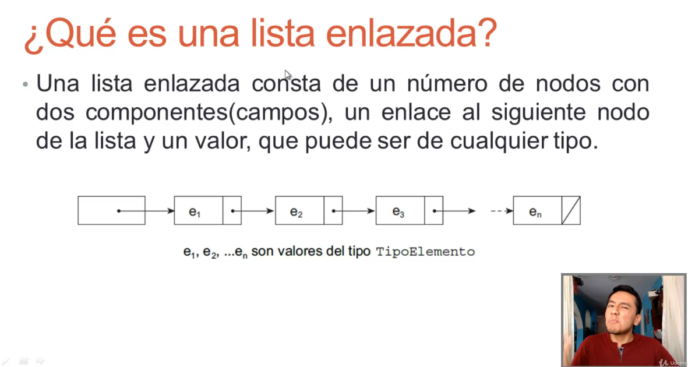
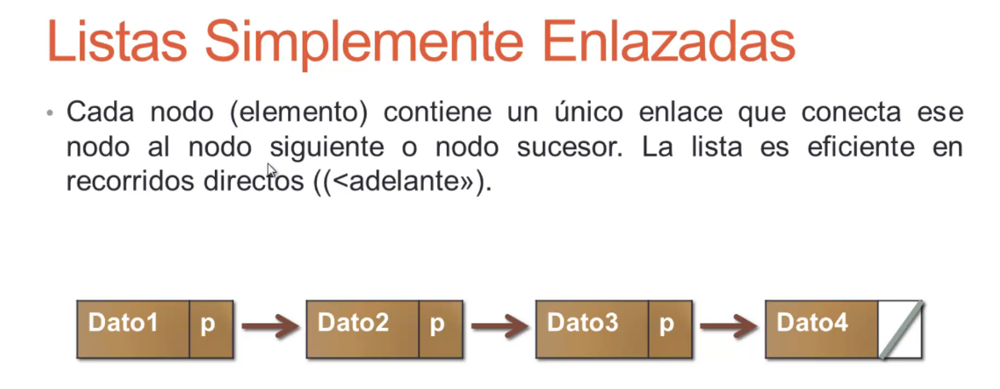
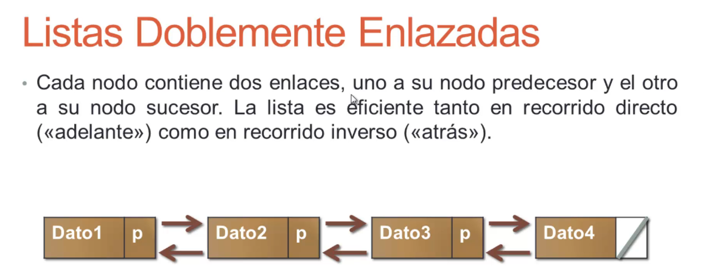
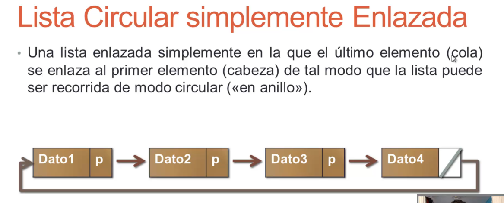
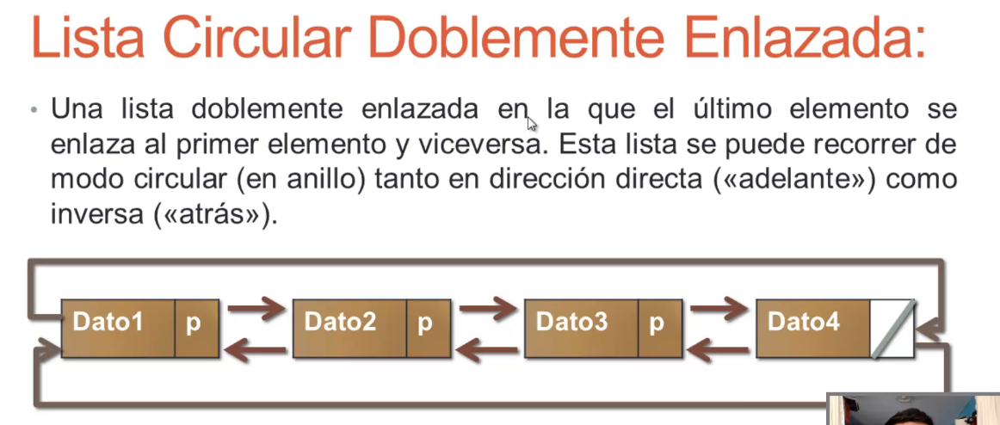

# Index

- [Arreglos](#arreglos)
    + [Asignacion Dinamica](#asignacion-dinamica)
- [Librerias](#librerias)
  * [Conio](#conio)
      - [Getch](#getch)
  * [stdlib](#stdlib)
      - [New y Delete](#new-y-delete)
- [Funciones](#funciones)
  * [Plantillas](#plantillas)
  * [Parametros por referencia](#parametros-por-referencia)
- [Punteros](#punteros)
  * [Arrays y Punteros](#arrays-y-punteros)
- [Listas enlazadas](#listas-enlazadas)
  * [Operaciones](#operaciones)
- [Arboles](#arboles)
- [Programacion Orientada a Objetos](#programacion-orientada-a-objetos)

<small><i><a href='http://ecotrust-canada.github.io/markdown-toc/'>Table of contents generated with markdown-toc</a></i></small>


# Arreglos
Debemos definir el tamaño del array desde la inicializacion

### Asignacion Dinamica
Podemos definir el tamaño del array dinamicamente, para esto utilizaremos 2 operadores:
- new: Reserva el numero de bytes solicitados por la declaracion
- delete: Libera un bloque de bytes reservado<br />

Los arreglos dinamicos se utilizan gracias a los punteros
```cpp
int numCalif, *calif;
void pedirNotas(){	
	cout<<"Digite el numero de calificaciones: ";
	cin>>numCalif;
	
	calif = new int[numCalif];
	
	for(int i=0;i<numCalif;i++){
		cout<<"Introduzca una nota: ";
		cin>>calif[i];
	}
}
```


# Librerias

## Conio
```c
#include<conio.h>
```

#### Getch
Para que termine el programa debo oprimir una tecla
```c
getch();
```

## stdlib

```c
#include<stdlib.h>
```

#### New y Delete
Funcionalidades que vamos a utilizar para manejar arreglos dinamicos

# Funciones

## Plantillas
Puedo utilizar plantillas para pasar en las funciones diferentes tipos de datos
```cpp

template <class TIPOD>
void despliegue(TIPOD dato);

int main(){
    int dato1 = 4;
	float dato2 = 5.678;
	double dato3 = 15.6789;
	char dato4 = 'a';
	
	despliegue(dato1);
	despliegue(dato2);
	despliegue(dato3);
	despliegue(dato4);
	
	
	getch();
	return 0;
}

template <class TIPOD>
void despliegue(TIPOD dato){
	cout<<"El dato es: "<<dato<<endl;
}

```

## Parametros por referencia
Le pasamos la direccion de memoria donde esta almacenada el valor, si cambia en la funcion lo veo cambiado afuera

```cpp
void intercambio(int&, int&);

int main(){
	int num1=10,num2=15;
	
	cout<<"El valor almacenado en num1 es: "<<num1<<endl;
	cout<<"El valor almacenado en num2 es: "<<num2<<endl;
	
	intercambio(num1,num2);
	
	cout<<"Ahora el nuevo valor de num1 es: "<<num1<<endl;
	cout<<"Ahora el nuevo valor de num2 es: "<<num2<<endl;			
	
	getch();
	return 0;
}

void intercambio(int& num1, int& num2){
	int aux;
	aux = num1;
	num1 = num2;
	num2 = aux;
}
```


# Punteros

## Arrays y Punteros
Puedo indicarle a un puntero el valor incial del array e ir incrementandolo para seguir accediendo a los otros valores, esto porque un vector se asigna en posiciones secuenciales de memoria
```cpp
int main(){
	int numeros[] = {1,10,32,2,5};
	int *p_numeros;
	
	p_numeros = numeros; 
	
	for(int i=0;i<5;i++){
		cout<<*p_numeros++<<endl;
	}
	
	getch();
	return 0;
}
```

# Listas enlazadas
<br/>
Los podemos dividir en 4 categorias<br />
<br/>
<br/>
<br/>
<br/>

## Operaciones
- Insertar elementos en una lista enlazada
- Mostrar elementos de una lista enlazada 
- Buscar un elemento en una lista enlazada
- Eliminar un elemento de una lista enlazada

# Arboles
No vamos a tener un puntero sino 2, no vamos a ir de forma lineal como los anteriores

# Programacion Orientada a Objetos
Por lo general se tienen separadas  las clases con las funcionalidades (Punto.h y Punto.cpp en POO clase 1)

```c++

class Punto{

	// Publico
	public:
		int x, y;

	private:
		int valorPrivado;

	//Metodos
	public:
		// Contructor
		Punto(int _x, int _y){
			x = y = 0;
		}

		void setX(int valorX);
}

```